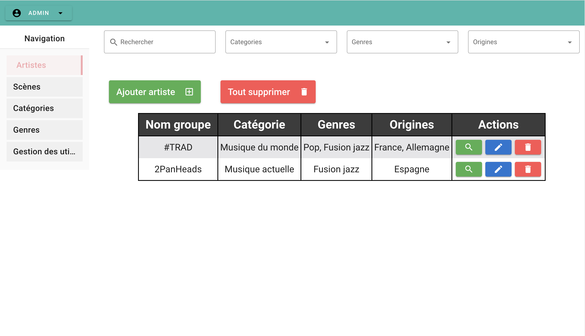

# SAE_FIMU

This project aims to provide a simple and easy to use interface for the [FIMU of Belfort](https://www.fimu.com). It is based on an API we developed in order to communicate with the database.

There are three main parts in this project :
- The API
- The web interface for administrators
<br>

## How to install the project and try it

---

### Requirements

- [Node.js](https://nodejs.org/en/)
- [PostgreSQL](https://www.postgresql.org/)
- [Vue-cli](https://cli.vuejs.org/)
- [Yarn](https://yarnpkg.com/)
- [MongoDB](https://www.mongodb.com/)

### Installation

1. Clone the project

```bash
git clone https://github.com/ArnaudCHEVALME/RenduAzar.git
```

2. Install the dependencies

```bash
cd SAE_FIMU/API
yarn install
cd ../vue
npm install
```

3. Create a database in PostgreSQL

```sql
psql -U login
CREATE DATABASE fimu;
```

4. To insert test data, uncomment the line 388 in the file `API/models/index.ts`
don't forget to comment the line after

5. Edit the configuration file

```bash
cp .env-template .env
vim .env
```

7. Run the web interface

```bash
cd ../vue
npm run serve
```

8. Open the web interface

Open your browser and go to [http://localhost:8080/login](http://localhost:8080/login)


The default login is `admin` and the default password is `admin`. You will be logged as an administrator. If you want to log as an editor, you can use the login `editor` and the password `editor`.

And that's it ! You can now try the web interface.



### Image API
To test the image API :
1. In the .env file inside the folder ServiceImage, just change the link to your database
2. Install the dependencies with `yarn install`
3. Run the API with `yarn start`
4. You can now test the API with Postman or Insomnia using the json file in the resource folder

### Notes
It is also possible to deploy the API using [docker](https://www.docker.com/) and [docker-compose](https://docs.docker.com/compose/). 
To do so, simply use the following commands :

To build and start the API :
```bash
docker-compose up -d
```

To stop the API :
```bash
docker-compose down
```
